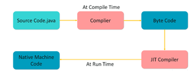

# Java 8 Interview Questions and Answers

## Q. What are the important features of Java 8 release?

* Interface methods by default;
* Lambda expressions;
* Functional interfaces;
* References to methods and constructors;
* Repeatable annotations
* Annotations on data types;
* Reflection for method parameters;
* Stream API for working with collections;
* Parallel sorting of arrays;
* New API for working with dates and times;
* New JavaScript Nashorn Engine ;
* Added several new classes for thread safe operation;
* Added a new API for `Calendar`and `Locale`;
* Added support for Unicode 6.2.0 ;
* Added a standard class for working with Base64 ;
* Added support for unsigned arithmetic;
* Improved constructor `java.lang.String(byte[], *)` and method performance `java.lang.String.getBytes()`;
* A new implementation `AccessController.doPrivileged` that allows you to set a subset of privileges without having to check all * other access levels;
* Password-based algorithms have become more robust;
* Added support for SSL / TLS Server Name Indication (NSI) in JSSE Server ;
* Improved keystore (KeyStore);
* Added SHA-224 algorithm;
* Removed JDBC Bridge - ODBC;
* PermGen is removed , the method for storing meta-data of classes is changed;
* Ability to create profiles for the Java SE platform, which include not the entire platform, but some part of it;
* Tools
    * Added utility `jjs` for using JavaScript Nashorn;
    * The command `java` can run JavaFX applications;
    * Added utility `jdeps` for analyzing .class files.

    <b><a href="#">↥ back to top</a></b>

## Q. Can you declare an interface method static?

Java 8 interface changes include static methods and default methods in interfaces. Prior to Java 8, we could have only method declarations in the interfaces. But from Java 8, we can have default methods and static methods in the interfaces.

    <b><a href="#">↥ back to top</a></b>

## Q. Why Java is not 100% Object-oriented?

Because of primitive data types namely: boolean, byte, char, int, float, double, long, short

	we have wrapper classes which actually “wrap” the primitive data type into an object of that class

    <b><a href="#">↥ back to top</a></b>

## Q. Why pointers are not used in Java?

Since JVM is responsible for implicit memory allocation, thus in order to avoid direct access to memory by the user,pointers are discouraged in Java

Increases the complexity of the program and since Java is known for simplicity of code, adding the concept of pointers will be contradicting

    <b><a href="#">↥ back to top</a></b>

## Q. What is JIT compiler in Java?

Java source code converts into byte code using JDK compiler and byte code converts into machine codes by using JRE or JVM in JRE there will be interpreter and JIT compiler 

* where Java code is machine independent. JDK and JRE are machine dependent.

* Interpreter will convert the byte code line by line into machine code.Decrase the effecinecy and increase the time.

* JIT compiler is used for perfomance it just converts bunch of byte code into machine code within less time without using interpretor.

    <b><a href="#">↥ back to top</a></b>

## Q. Why String is immutable in java?

security because string is shared on different area like file system, networking connection, database connection , having immutable string allows you to be secure and safe because no one can change reference of string once it gets created.

    <b><a href="#">↥ back to top</a></b>

## Q. What is a marker interface?

A Marker interface can be defined as the interface having no data member and member functions. In simpler terms, an empty interface is called the Marker interface.

    <b><a href="#">↥ back to top</a></b>

## Q. Can you override a private or static method in Java?

you cannot override a private method in sub class because it's not accessible there, we can do is create another private method with the same name in the child class

For static methods if you create a similar method with same return type and same method arguments in child class then it will hide the superclass method, this is known as method hiding

    <b><a href="#">↥ back to top</a></b>

 
## Q. Does “finally” always execute in Java?

Doesnot executes only in following cases;

	“System.exit()” function;
	system crash;

    <b><a href="#">↥ back to top</a></b>

 
## Q. What Methods Does the Object Class Have?

Java.lang.Object class, parent of all has following methods:
	
	#protected Object clone() throws CloneNotSupportedException;
	Creates and returns a copy of this object;
	#public boolean equals(Object obj);
	Indicates whether some other object is “equal to” this one;
	#protected void finalize() throws Throwable;
	Called by the garbage collector on an object when garbagecollection   determines that there are no more references to the object;
	#public final Class getClass() : Returns the runtime class of an object;
	#public int hashCode(): Returns a hash code value for the object;
	#public String toString(): Returns a string representation of the object;
	#public final void notify();
	#public final void notifyAll();
	#public final void wait();
	#public final void wait(long timeout);
	#public final void wait(long timeout, int nanos);

    <b><a href="#">↥ back to top</a></b>

